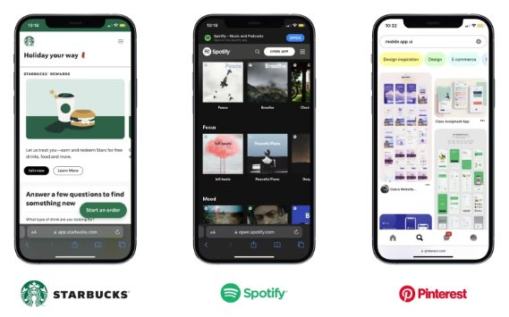

# Workshop Script

A Progressive Web App (PWA) try to offer the best aspects of web and mobile applications. With features like offline access, fast loading times, push notifications, and cross-device compatibility, PWAs deliver a a rich user experience without the need of an AppStore. PWAs are cost-effective, easily shareable, and discoverable, making them an ideal choice for businesses seeking a modern and efficient way to connect with users on the web.

## Brief history of PWAs

Progressive Web Apps (PWAs) have a relatively recent history, evolving as a response to the changing landscape of web development and the increasing capabilities of modern browsers. Here's a brief timeline of the key events in the history of PWAs:

- 2007: Introduction of the iPhone: The release of the iPhone marked a significant shift in user behavior, with an increasing reliance on mobile devices for accessing the web.
- 2010: Responsive Web Design (RWD): Ethan Marcotte introduced the concept of Responsive Web Design, advocating for the creation of websites that adapt seamlessly to various screen sizes and devices.
- 2015: Service Workers Introduced and "Progressive Web Apps" Coined by Google: This term emphasized the importance of building web applications that provide a native app-like experience. The new API enables background script execution, allowing features like caching, push notifications, and offline access.
- 2018: Commercial Success: Twitter Lite and Spotify launched PWAs, further demonstrating the feasibility and advantages of this approach for major applications. Spotify and others soon join to extend their reach to new global audiences.
- 2020s: Continued Growth and Adoption: PWAs continue to gain momentum as browsers are still just rising the the challenge. iOS significantly lagging behind Android.

### Shifting from native apps to webapps

We are finally at a point where the script can flip. In the early days of smartphones, many wanted their own native app. As App Stores grew, their was a lot of hype around having a dedicated, branded space on someone's device. But in practice, creating native apps had a lot of barriers and costs:

- Development and matinence costs are higher. New languages, tools, and systems are required to build apps native to iOs of Android. Maintaining two distinct apps increases development, testing, and operations costs. News skills are required by your development team.
- App Store Approval Process: Native apps must go through app store approval processes, which can be time-consuming and unpredictable. The approval process may change regularly and vary by region. Regular updated may be required to stay on the marketplace.
- Discoverability and availability: With a native app, users must actively search and download it from an app store. Users may hesitate to download and install apps, leading to lower user engagement. Companies with interational may struggle to reach all models and old versions of devices.

So I often would steer clients to mobile-first web designs. We made the content as adaptable and responsive as possible to provide a seemless experience for users across multiple devices. However we would seem changing winds with the advent of the newest browser APIs including service workers. Review the state browser support: https://whatwebcando.today/


### Advantages of PWAs

Mobile-friendly websites have evolved to access more device hardware in a meaningful way, approaching the functionality of native apps. Progressive Web Apps (PWAs) stand out as an exciting option for developers and a valuable asset for clients.

- Cross-Platform Compatibility: PWAs seamlessly operate across various devices and platforms, offering a consistent user experience without requiring multiple development teams.
- Offline Functionality: Through service workers, PWAs cache essential resources, enabling users to access content even when offline.
- Improved Performance: Leveraging modern web technologies, PWAs deliver a more efficient and enjoyable user experience, fostering higher engagement and retention.
- App-Like Experience: PWAs mimic native mobile apps with features like push notifications, full-screen mode, and smooth animations, allowing users to interact seamlessly without needing app store installations.
- Easy(ish) Installation: While providing an app-like experience, PWAs are accessible directly through web browsers, eliminating the need for installations from app stores.
- Automatic Updates: PWAs self-update, ensuring users always have the latest version without manual intervention, streamlining the update process without relying on app stores.

## Who's using PWAs



- https://www.google.com/maps
- https://open.spotify.com
- https://app.starbucks.com
- https://www.pinterest.com
- https://airhorner.com

## Building a simple PWA

This project serves as a demonstration of Progressive Web Apps (PWAs) features by building a one page personal website. PWAs offer a seamless, app-like experience across devices, offline functionality through service workers, and efficient caching strategies. Together, we'll explore:

- The lifecycle and limitations of service workers.
- Caching strategies and their respective business cases.
- Debugging PWAs using browser developer tools.

### Project Setup

While the PWA is simply HTML and other static assets, running it through the file protocol (opening HTML files directly from your local file system without a web server) can lead to certain issues. PWAs often rely on features that are available when served over HTTP or HTTPS, and accessing them through the file protocol may not provide the necessary environment. We are using a Express as an NPM package to serve the files for this application.

```bash
# Setup a project wih an Express web server and web root folder
npm init -y
npm install express --save
mkdir public
```

```js
// server.js
const express = require('express');
const app = express();
const port = process.env.PORT || 3000;
app.use(express.static(__dirname + '/public'));
app.listen(port, () => {
  console.log(`Server is running on http://localhost:${port}`);
});
```

### Step 2: Create Your HTML

We've opted for simplicity by using a single HTML file as a static page. This intentional choice is aimed at helping developers, especially those new to PWAs, understand the core concepts without feeling overwhelmed. However, it's worth noting that PWAs are often developed within complex JavaScript applications like React, Next.js, SvelteKit, and many others.

To get started, create your web app's layout in an HTML file, for instance, `public/index.html`. Ensure that you include the required meta tags for viewport settings. This should include a link to `manifest.json` that will be added in the next step.

```html
<!DOCTYPE html>
<html lang="en">
<head>
  <meta charset="UTF-8">
  <meta name="viewport" content="width=device-width, initial-scale=1.0">
  <title>Jim Vomero</title>
  <link rel="manifest" href="/manifest.json">
</head>
<body>
  Hi. I'm Jim.
</body>
</html>
```

### Step 3: Add a Manifest File

A manifest is a JSON file that contains metadata about the web application. The file serves as a blueprint for PWAs, encapsulating essential metadata and configurations. It defines the app's identity, appearance, and behavior, enabling seamless integration with users' devices, improved discoverability, and a consistent experience across various platforms. Key properties include:

- name: The name of the app.
- short_name: A shorter version of the app name, often used on device home screens.
- description: A brief description of the app.
- start_url: The URL where the app should start when launched.
- display: Specifies how the app should be displayed. Options include "fullscreen," "standalone," "minimal-ui," and "browser."
- background_color: The background color of the app.
- theme_color: The color that defines the app's theme.
- icons: An array of icon objects specifying images for different screen resolutions and contexts.
- orientation: Specifies the default orientation for the app.
- scope: Defines the navigation scope of the service worker.
- related_applications: Information about related native apps.
- prefer_related_applications: A flag indicating whether to prefer launching related native applications.

https://app-manifest.firebaseapp.com

Create a `public/manifest.json` file in your project directory.

```json
{
  "name": "My Awesome PWA",
  "short_name": "My Awesome PWA",
  "description": "A description of your PWA",
  "start_url": "/",
  "display": "standalone",
  "background_color": "#ffffff",
  "theme_color": "#4285f4",
  "icons": [
    {
      "src": "/icons/icon-192x192.png",
      "sizes": "192x192",
      "type": "image/png"
    }
  ]
}
```

Test this in your developer tools and verify that the manifest file appears.

### Step 4: Set Up a Basic Service Worker

Service workers act as silent managers, giving web applications with offline capabilities, background synchronization, and efficient caching. These JavaScript workers run separately from the main browser thread, enabling PWAs to deliver a faster and more reliable user experience by intercepting network requests and managing data caching, ultimately fostering seamless interactions regardless of network conditions. Create a `public/service-worker.js` file.

```js
// public/service-worker.js
self.addEventListener('install', (event) => {
  // Install Event Listener
});
// Activate Event Listener
self.addEventListener('activate', (event) => {
  // Activate Event Listener
});
self.addEventListener('fetch', (event) => {
  // Fetch Event Listener
});
self.addEventListener('push', (event) => {
  // Push Notification Event Listener
});
```

### Step 5: Register the Service Worker

Registering a service worker enables the Progressive Web App (PWA) features. This process establishes a bridge between the web page and the separate service worker that is running the background. Update the `public/index.html` file to register the service worker by adding the following script:

```js
<!-- index.html -->
  <!-- ... (same as before) ... -->
<body>
  <!-- ... (same as before) ... -->
  <script>
    if ('serviceWorker' in navigator) {
      navigator.serviceWorker.register('/service-worker.js')
        .then((registration) => {
          console.log('Service Worker registered with scope:', registration.scope);
        })
        .catch((error) => {
          console.error('Service Worker registration failed:', error);
        });
    }
  </script>
</body>
</html>
```

Test the app and verify that the service worker is registered.

### Step 6: Add a caching mechanism

In this simple example, the service worker is designed to cache all items listed in the CACHE_ASSETS array during installation. This background task allows for prefetching a variety of assets, optimizing load times for users engaging with your web app. This prefetching capability ensures that a substantial set of assets is readily available, contributing to an enhanced user experience by minimizing loading delays. It's worth noting that there are various caching strategies available, each offering unique advantages and use cases beyond this basic example.

```js
// public/service-worker.js
const CACHE_NAME = 'my-pwa-v1';
const CACHE_ASSETS = [
  '/',
  '/index.html',
  '/icons/icon-192x192.png',
  // Add other paths to be cached
];

self.addEventListener('install', (event) => {
  event.waitUntil(
    caches.open(CACHE_NAME).then((cache) => {
      return cache.addAll(CACHE_ASSETS);
    })
  );
});

self.addEventListener('fetch', (event) => {
  event.respondWith(
    caches.match(event.request).then((response) => {
      return response || fetch(event.request);
    })
  );
});
```

Test this by viewing the app offline. You can also inspect the cache in developer tools.

### Step 6: Run the Application

```bash
node server.js
```

View your app in your web browser and use the debugging tools to confirm the correct loading of the manifest and the storage of assets in the cache. Experiment by temporarily disabling internet access to ensure the webpage still loads seamlessly. While this newfound control over caching opens up exciting possibilities, it does, regrettably, mean fewer opportunities to indulge in the Chrome Dino game.
